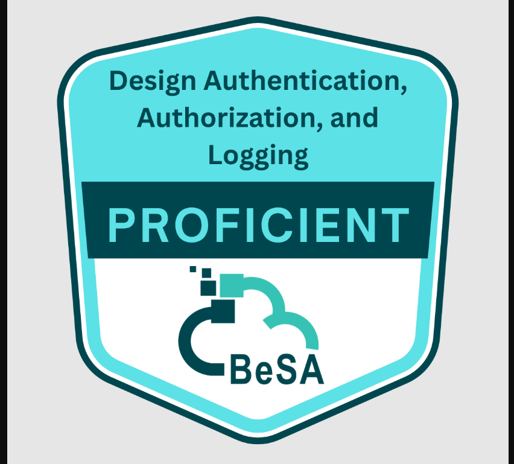

# Agent Identity Management on AWS

A hands-on build of identity and authorization into an AI agent's tools on AWS - layering
**Amazon Bedrock AgentCore Gateway** (inbound auth per tool), **AgentCore Identity** (outbound,
cross-trust-domain credentials), and **Amazon Verified Permissions / Cedar** (per-caller, per-tool
authorization) onto a single Strands agent, one capability at a time, across six workshop
activities.

 

## Contents

- [How to explore this repo](#how-to-explore-this-repo)
- [The problem](#the-problem)
- [The identity layers](#the-identity-layers)
- [What I built](#what-i-built)
- [Code](#code)
- [Key takeaways](#key-takeaways)
- [What I'd change for a production system](#what-id-change-for-a-production-system)
- [Tech stack](#tech-stack)
- [Proof of work](#proof-of-work)
- [Certification](#certification)
- [Disclaimer](#disclaimer)
- [License](#license)

## How to explore this repo

| If you're here to... | Start with |
|---|---|
| Get the 2-minute version | This README, top to bottom |
| See the whole system at once | [`architecture/system-architecture.md`](architecture/system-architecture.md) - every service assembled into one diagram, plus the deployment pipeline |
| Evaluate the identity architecture | [`architecture/HLD.md`](architecture/HLD.md) - requirements, candidate approaches scored, decision, and a full request sequence in [`architecture/gateway-identity-flow.md`](architecture/gateway-identity-flow.md) |
| See the technical depth, activity by activity | [`docs/`](docs/) - six walkthroughs, each with real screenshots |
| Check which AWS service does what | [`aws-services/`](aws-services/) - official icons mapped to their role, plus a full icon-composited architecture diagram |
| Look at actual code | [`code/`](code/) - read [`code/README.md`](code/README.md) first; this is the real workshop source, not a reconstruction |

## The problem

Giving an AI agent tools is easy. Giving it tools *safely* - without hardcoding a secret per
integration, without every caller seeing every tool regardless of role, and without the agent
holding a standing credential into a system it doesn't own - is a separate, harder problem that
most "connect your agent to an API" tutorials skip entirely.

This project builds up the answer incrementally, using a retail scenario ("AnyCompany Retail")
where an employee-facing agent needs to: answer questions from a Terms-of-Service Lambda, query
Sales/Products/Customer-Reviews data behind Cognito-authenticated API Gateway endpoints, call a
*supplier's* Inventory MCP server that AnyCompany has no account in, and show a Manager, an Admin,
and an external Supplier three different toolsets from the same running agent.

## The identity layers

| | AgentCore Gateway | AgentCore Identity | Verified Permissions (Cedar) |
|---|---|---|---|
| **Question it answers** | Who may reach this tool endpoint at all? | What credential does the agent present on the far side of an outbound call? | Which specific tools may *this* authenticated caller use? |
| **Direction** | Inbound (caller → gateway → target) | Outbound (agent → external system) | Neither - a policy check the agent runs before deciding what to even load |
| **Added in** | Activity 2 (IAM/SigV4), extended in 3a/3b/3c (Cognito OAuth2) | Activity 4 (cross-account M2M OAuth2) | Activity 5 |
| **What it prevents** | An unauthenticated caller reaching a tool's backend directly | A vendor's OAuth2 client secret living in the agent's code/image | Every authenticated user seeing every tool regardless of role |

Full requirements-driven comparison and the decision matrix: [**High-Level
Design**](architecture/HLD.md). Full request-by-request trace through all three layers at once:
[**gateway-identity-flow.md**](architecture/gateway-identity-flow.md).

## What I built

Module numbering and titles mirror the workshop's own activity structure exactly, so this table
doubles as the workshop's table of contents:

| Activity | What it covers |
|---|---|
| [Activity 1 - Introduction to your AI agent](docs/01-activity1-introduction-to-your-ai-agent.md) | A tool-less Strands agent deployed to AgentCore Runtime with Cognito JWT inbound auth - the identity-free starting point everything else builds on |
| [Activity 2 - Add the Terms of Service tool](docs/02-activity2-add-the-terms-of-service-tool.md) | Wiring the first AgentCore Gateway (IAM/SigV4 inbound auth) in front of a single Lambda tool |
| [Activity 3 - Deploy the Sales, Products, and Reviews tools](docs/03-activity3-sales-products-reviews-tools.md) | A second gateway, this time Cognito OAuth2 inbound auth, fronting three API Gateway-backed tools |
| &nbsp;&nbsp;&nbsp;[Activity 3a - Deploy the Sales tool](docs/03a-activity3a-deploy-the-sales-tool.md) | First target on the new gateway |
| &nbsp;&nbsp;&nbsp;[Activity 3b - Deploy the Products tool](docs/03b-activity3b-deploy-the-products-tool.md) | Second target, own OAuth2 client |
| &nbsp;&nbsp;&nbsp;[Activity 3c - Deploy the Customer Reviews tool](docs/03c-activity3c-deploy-the-customer-reviews-tool.md) | Third target, gateway complete |
| [Activity 4 - Add the Inventory MCP Tool](docs/04-activity4-add-the-inventory-mcp-tool.md) | AgentCore Identity minting a short-lived M2M token so the agent can call a supplier's Inventory MCP server without holding a standing credential |
| [Activity 5 - Add the dynamic tool filtering capability](docs/05-activity5-dynamic-tool-filtering-capability.md) | Amazon Verified Permissions gating which tool groups and tools each authenticated role (Manager, Admin, Supplier) can load, per request |

## Code

[`code/`](code/) is the actual workshop source pulled out of the lab's Cloud IDE - not a
reconstruction. `agent_core.py` carries AWS's own MIT-No-Attribution header. See
[`code/README.md`](code/README.md) for exactly what's covered by that license, what `agent_core.py`
represents (the starting template, not the fully-wired end state), and what's deliberately excluded.

## Key takeaways

1. **Inbound and outbound auth are different problems, and conflating them stalls at the first
   cross-account tool.** AgentCore Gateway decides who may call in; AgentCore Identity decides what
   the agent presents going out. Activity 4's supplier integration only works cleanly because those
   two questions were already kept separate from Activity 2 onward.
2. **Authorization belongs before the model sees the tool, not in the prompt.** Verified Permissions
   filters the actual tool objects passed into the `Agent(...)` constructor per request - there's no
   "please don't use this tool" instruction for the model to potentially ignore.
3. **A credential vault only pays off if nothing bypasses it.** `agent_core.py` keeps a `client_id`/
   `client_secret` OAuth2 helper function around explicitly commented as "retained for backward
   compatibility" - a reminder that a safer pattern existing alongside an older one is only as good
   as consistently choosing the safer path for every new tool.
4. **Two-phase authorization is a deliberate cost/correctness trade-off.** A cheap pre-check against
   *declared* resource ids avoids opening MCP connections nobody's authorized to use; the
   authoritative check against the *actual* tool list returned by the gateway is what's really
   enforced - see [Activity 5](docs/05-activity5-dynamic-tool-filtering-capability.md).
5. **Incremental identity adoption is possible when the primitives compose.** Each activity added
   exactly one new gateway, provider, or policy without editing how the tools already wired in
   authenticate - a direct result of `agent_core.py`'s `TOOL_GROUPS` registry pattern.

## What I'd change for a production system

- Version the Cedar policies the same way an API is versioned, so an authorization decision is
  attributable to a specific policy revision at call time, not just "whatever was in the store."
- Add alerting around an AVP outage - as written, `_authorize_tool_ids` fails closed (denies
  everything) when Verified Permissions is unreachable, which is the safe default but should page
  someone rather than silently serve a degraded agent.
- Move from a single rolling `agent.py.backup` (overwritten by each `activity*_gen.sh` run) to real
  version control for the generated file, so a bad snippet substitution is a `git revert`, not a
  one-generation-deep backup.
- See the full list with rationale in [`architecture/HLD.md`](architecture/HLD.md#what-id-change-for-a-production-system).

## Tech stack

Amazon Bedrock AgentCore (Runtime, Gateway, Identity) · Amazon Bedrock · Amazon Cognito · Amazon
Verified Permissions (Cedar) · Amazon API Gateway · AWS Lambda · Amazon S3 · AWS CodeBuild · Amazon
ECR · AWS CloudFormation · AWS IAM · Amazon CloudWatch · Strands Agents SDK · Model Context Protocol
(MCP) · Python

See [`aws-services/`](aws-services/) for how each service maps to its role in this architecture,
with the official AWS service icons.

## Proof of work

Screenshots of the actual deployed system (AgentCore Gateway/Identity console configuration,
Cognito setup, Verified Permissions policies, and live chat-agent tests across three different
authenticated roles) are embedded throughout the module docs in `docs/`, next to the explanation of
what each one shows. A handful that exposed a real AWS account ID or ARN were redacted before being
included.

## Certification

See [`CERTIFICATION.md`](CERTIFICATION.md).

## Disclaimer

Thanks to BeSA and AWS for the hands-on environment and compute that made this build possible.

This is an independent write-up of my own hands-on work completing a lab on the BeSA workshop
platform. The lab content itself is AWS's own **"SEC307: Agent Identity Management"** re:Invent
workshop - confirmed by AWS's MIT-No-Attribution copyright header in the workshop's own agent
source and the repeated "SEC307 Workshop" labeling throughout its scripts - delivered through
BeSA's environment rather than directly through AWS. All explanations, diagrams, and opinions are
my own, shared as a learner's independent project - not a publication of AWS or BeSA.

## License

[MIT](LICENSE)
