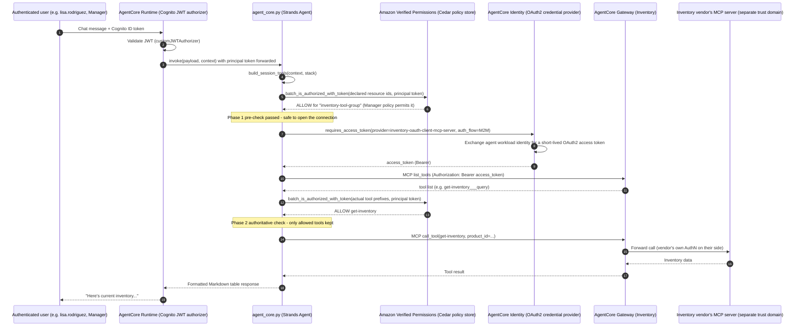

# Sequence - One Request Through Gateway, Identity, and AVP

This traces a single chat message ("show me current inventory levels") through every identity
layer added across Activities 2-5, using the Activity 4 (Inventory, cross-trust-domain) path since
it exercises all three primitives at once: inbound Cognito JWT auth on the agent runtime, an
AgentCore Identity outbound token exchange, and an AVP authorization check gating whether the
Inventory tool group is even loaded for this caller.

## What each layer is actually deciding

- **Runtime JWT validation (steps 1-2)** answers *"is this a real, authenticated AnyCompany user at
  all?"* - unrelated to which tools they can use.
- **AVP phase 1 (steps 5-6)** answers *"is it even worth opening a connection to this tool group for
  this caller?"* - a cheap skip, not the authoritative decision.
- **AgentCore Identity (steps 8-10)** answers *"what credential does the agent present to a system
  outside AnyCompany's own trust domain?"* - the M2M token exchange means the Inventory vendor's
  OAuth2 client secret never touches the agent's code or container image (F2/F4 from the HLD).
- **AVP phase 2 (steps 12-13)** is the *authoritative* decision, made after the real tool list comes
  back - this is what actually determines which tool objects the LLM ever sees.

A different caller (e.g. james.miller, an external Supplier) hits the same sequence but gets an
AVP `DENY` at step 6 for tool groups outside their role - the connection to that gateway is never
even opened, which is why [Activity 4](../docs/04-activity4-add-the-inventory-mcp-tool.md) and
[Activity 5](../docs/05-activity5-dynamic-tool-filtering-capability.md) show different users of the identical
agent seeing entirely different tool sets.
