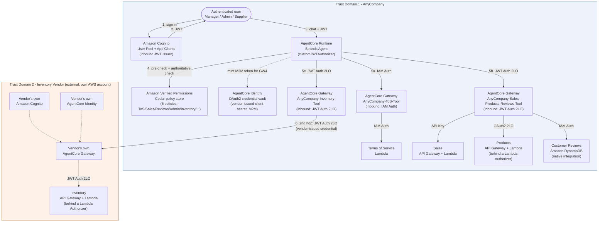
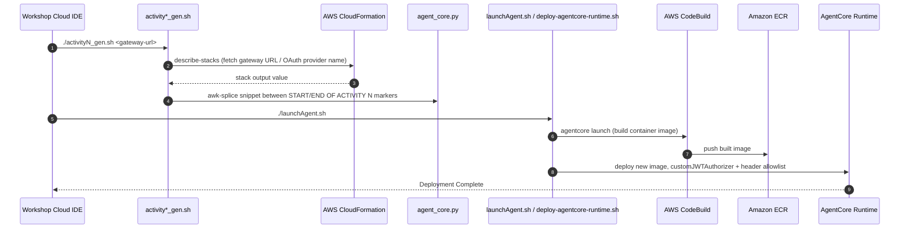

# System Architecture - The Complete Picture

The [per-activity diagrams in `docs/`](../docs) each show the system as it stood after *one*
activity, built up incrementally. This page is the other view: everything assembled at once, plus
the deployment pipeline that isn't visible in any single activity's diagram because it's used
identically by all of them.

## The full runtime architecture (end of Activity 5)

Everything in **Trust Domain 1** is AnyCompany's own account, including `AnyCompany-Inventory-Tool`
(`GW4`) itself - it's a gateway AnyCompany owns and configures like any other. **Trust Domain 2** is
the one subgraph the agent doesn't own: the vendor runs their *own* independent Cognito pool,
AgentCore Identity, and AgentCore Gateway, and `GW4`'s target is configured to reach into that
domain as a second, separately-authenticated hop. The agent's own code only ever touches `GW4`
directly - see [Activity 4](../docs/04-activity4-add-the-inventory-mcp-tool.md) for why that
distinction (one gateway the agent calls vs. two gateways actually involved) matters, and
[`gateway-identity-flow.md`](gateway-identity-flow.md) for the sequence from the agent's point of
view.

Activity 3's targets are also intentionally heterogeneous - Sales, Products, and Reviews sit behind
the *same* gateway and the *same* inbound JWT auth, but each target authenticates outbound to its
own backend differently (API key, OAuth2, and a bare IAM role respectively), because that's what
each backend actually is: a Lambda, a Lambda behind an authorizer, and a DynamoDB table accessed
through a native integration with no Lambda at all. See [Activity 3](../docs/03-activity3-sales-products-reviews-tools.md)
for the full breakdown.

## The deployment pipeline (used identically by every activity)

None of the activity diagrams show *how* a code change actually reaches the running agent, because
the same pipeline is reused unchanged from [Activity 1](../docs/01-activity1-introduction-to-your-ai-agent.md)
through Activity 5 - only the contents of `agent_core.py` change between runs:

This is also why [`code/README.md`](../code/README.md) is explicit that `agent_core.py` in this
repo is the *template*, not any single activity's filled-in result - the same file gets
re-spliced and redeployed through this exact pipeline at every stage.

## How this maps to the other architecture docs

| Document | Answers |
|---|---|
| **This page** | What does the whole system look like, all at once, and how does a change get deployed? |
| [`HLD.md`](HLD.md) | Why this architecture - requirements, candidate approaches scored, decision |
| [`gateway-identity-flow.md`](gateway-identity-flow.md) | What happens on one specific request, step by step, across all three identity layers |
| [`docs/*.md`](../docs) | What did the system look like right after *this* activity, incrementally |
| [`aws-services/README.md`](../aws-services/README.md) | Which AWS service plays which role, with icons |
