# Activity 1: Introduction to your AI agent

## Architecture after this activity

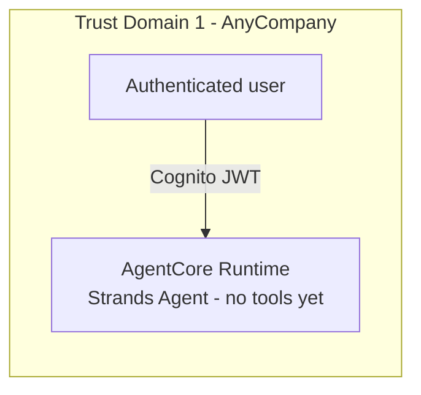

Just the runtime and its inbound Cognito JWT authorizer - no gateway, no tool, exists yet. Every
later activity adds exactly one box to this diagram.

## The starting point: an agent with no tools at all

Before any identity primitive gets added, the lab starts from a Strands agent with zero
capabilities - it can chat, but it's explicitly instructed to decline every AnyCompany-specific
question, because it has no tool to answer one. This is the deliberate baseline every later
activity builds on: adding a tool later is additive, never a rewrite of how the agent reasons.

The workshop environment is a VS Code-based Cloud IDE with the AWS CLI pre-configured to the
target account:

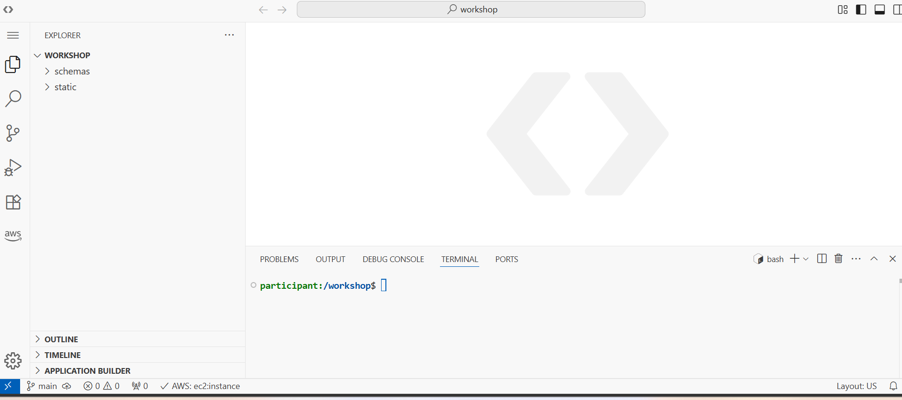

The scaffold laid out in `static/AgentCode/` already has every activity's generator script
present (`activity2_gen.sh` through `activity5_gen.sh`) even though none have run yet - the whole
lab structure is visible from step one:

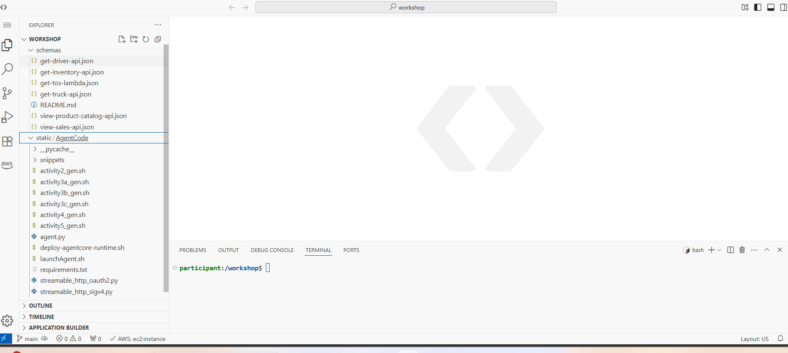

## Deploying the empty agent

`agent_core.py`'s real imports - `BedrockAgentCoreApp`, Strands' `Agent`/`BedrockModel`, and both
custom MCP transport modules - are present from the start, even before any of them are exercised
by a connected tool:

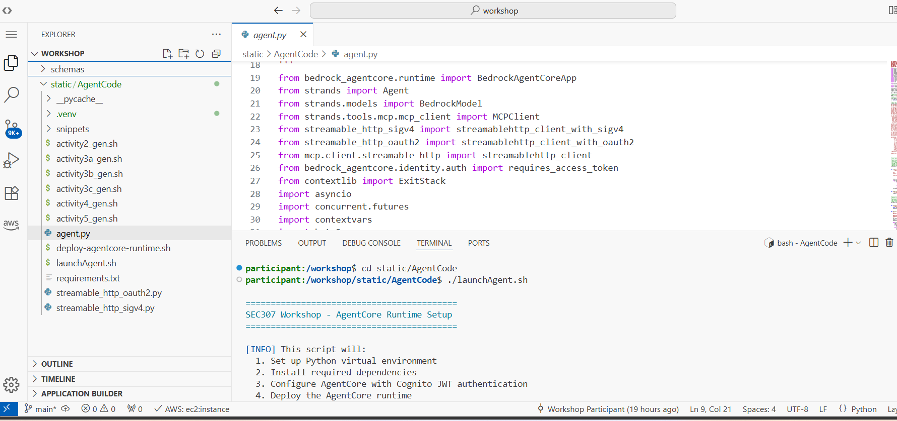

`launchAgent.sh` is the single entry point used to deploy at every stage of the lab, not just this
first one - it wraps `agentcore configure`/`launch` from the Python
`bedrock-agentcore-starter-toolkit`:

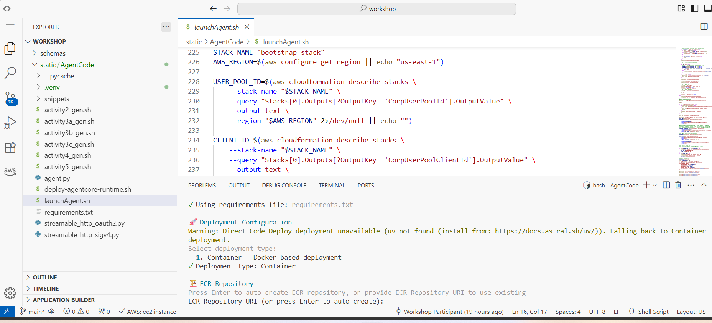

Deployment builds and pushes a container image via CodeBuild before the AgentCore Runtime can host
it:

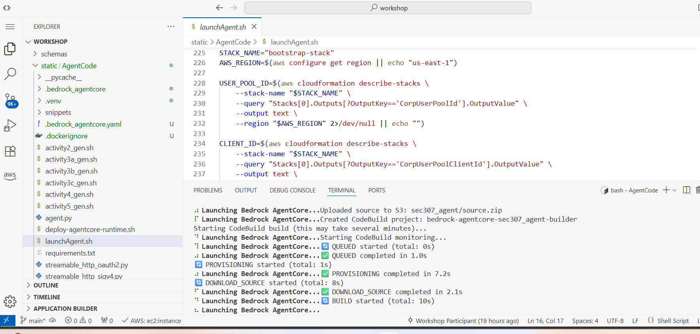

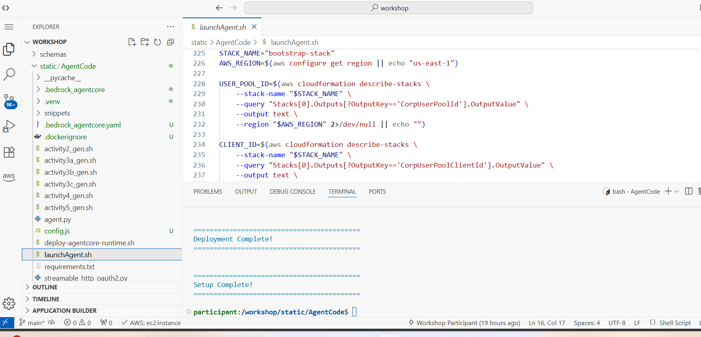

## Runtime configuration: JWT auth from day one

The AgentCore Runtime console shows the deployed `sec307_agent`, ready, with Cognito JWT already
configured as its inbound authorizer - identity isn't bolted on later, it's part of the runtime
from the very first deploy:

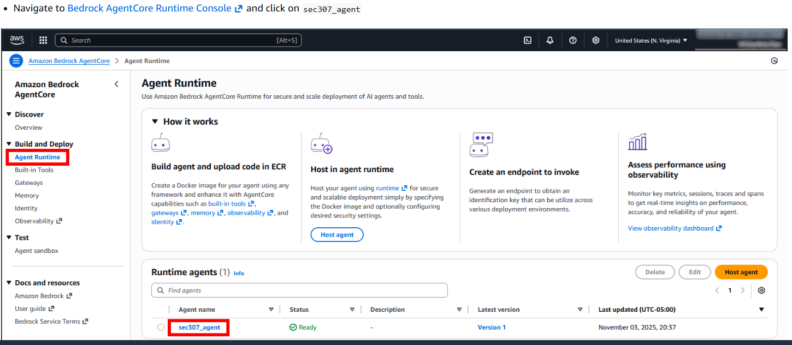

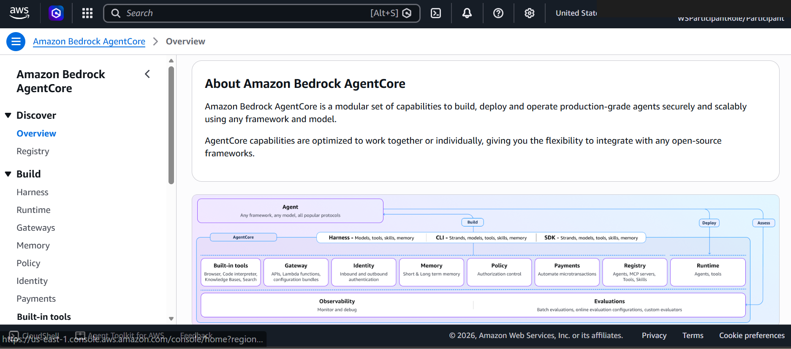

CloudWatch log delivery is configured explicitly for the runtime, including a dedicated
`USAGE_LOGS` delivery stream - this is what later modules query to see per-request behavior:

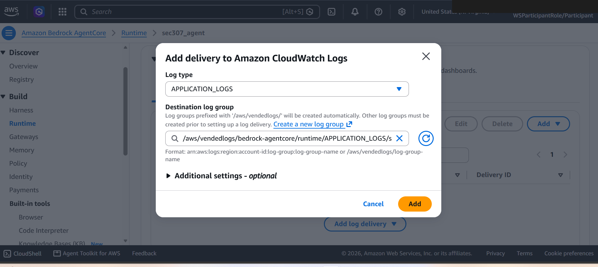
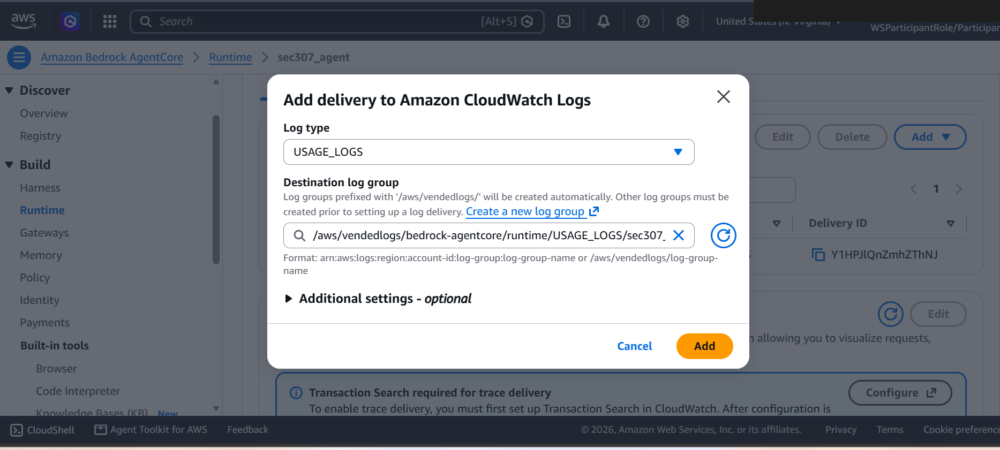

## Talking to a tool-less agent

The chat frontend ("Sales Operations Assistant") is what every later activity tests against, as a
fictional AnyCompany employee (`sarah.johnson`):

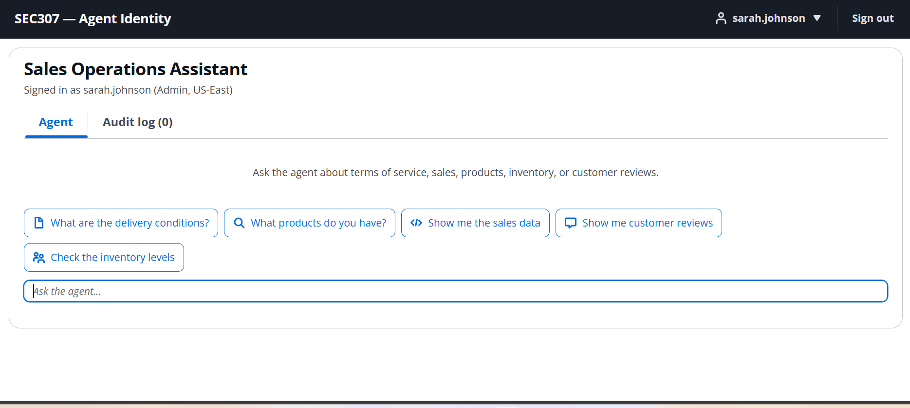

Asking it anything beyond a generic "about me" gets the agent's hard-coded decline sentence, by
design - there is no tool yet for it to ground an answer in:

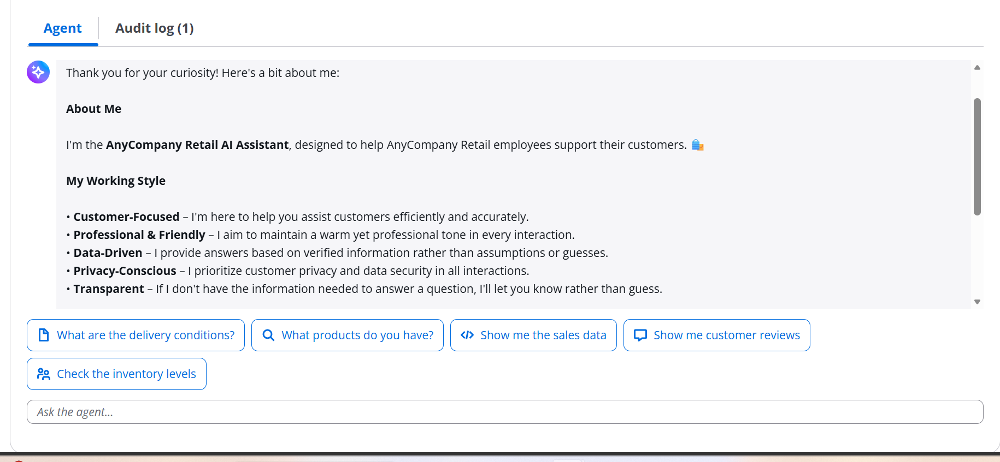

## Why this matters for everything that follows

The system prompt's grounding rule - *never answer from anything but a tool result, and decline
with one fixed sentence otherwise* - is what makes every subsequent activity's authorization layer
actually meaningful. If the model could fall back on general knowledge, filtering which tools it
can load (Activity 5) wouldn't stop it from producing a plausible-sounding but ungrounded answer
anyway. See [Activity 2](02-activity2-add-the-terms-of-service-tool.md) for the first tool this rule gets
tested against.
