# Activity 2: Add the Terms of Service tool

## Architecture after this activity

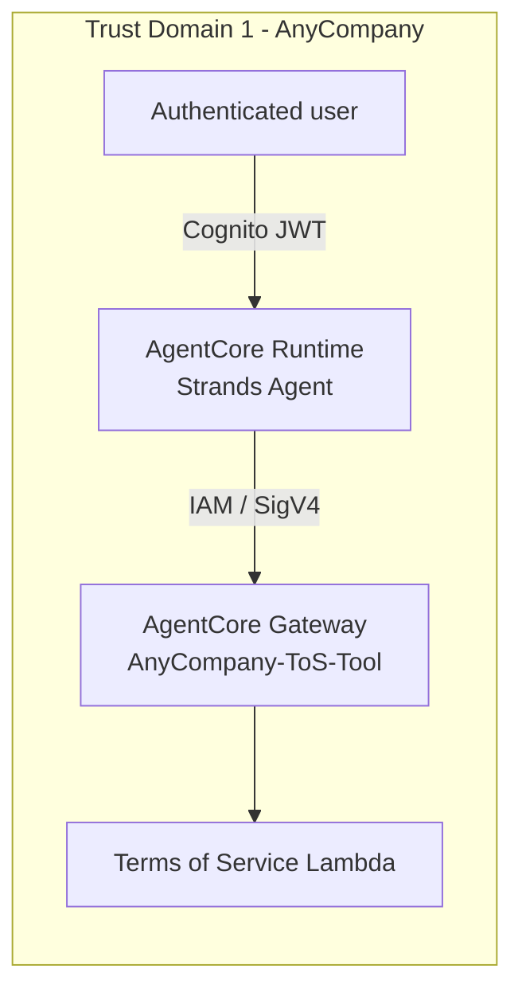

The first gateway, fronting a single Lambda with the agent's own IAM execution role as the
credential - no OAuth2 client to manage yet, since there's nothing to federate.

## Adding the first identity boundary

Activity 2 is where AgentCore Gateway shows up for the first time: a single Lambda tool (Terms of
Service lookup) gets fronted by a gateway with **IAM/SigV4** inbound auth - the agent's own
execution role is the credential, no separate client secret to manage yet. Creating the gateway
starts with naming it and picking its inbound auth mode:

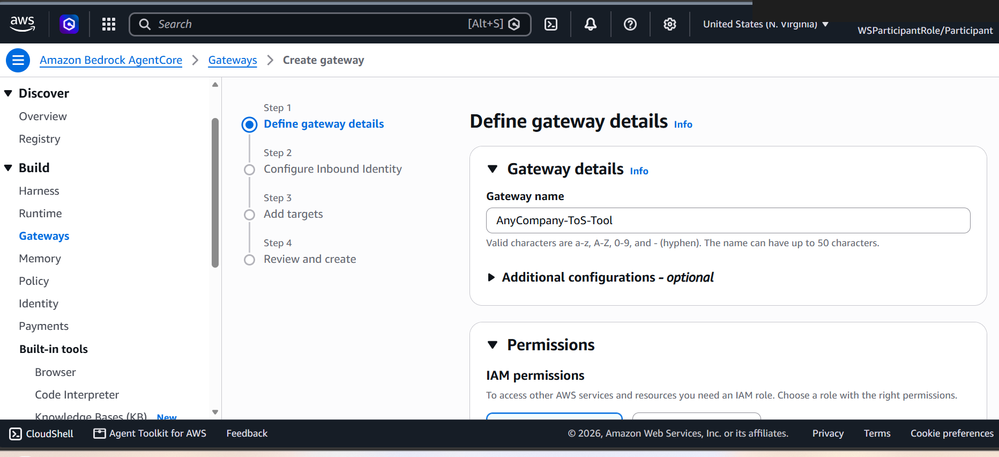

The workshop's CloudFormation stacks (`bootstrap-stack`, `direct-targets-stack`,
`standalone-mcp-server-stack`) are what actually provisioned the Lambda and its schema behind the
scenes - the gateway just needs to know where to point:

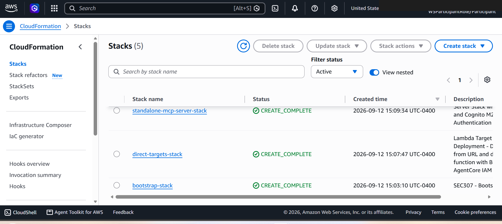

Step 2 of gateway creation is choosing the inbound identity mode - IAM for this activity, JWT from
Activity 3 onward:

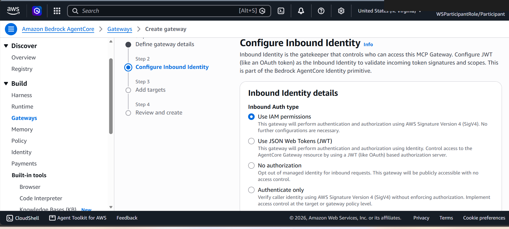

## Wiring the target

Adding the Lambda as an MCP target requires its input/output schema - this is
[`code/schemas/get-tos-lambda.json`](../code/schemas/get-tos-lambda.json), a plain JSON Schema
describing a single `clause_type` parameter (`Refund`, `Delivery`, or `Payment`):

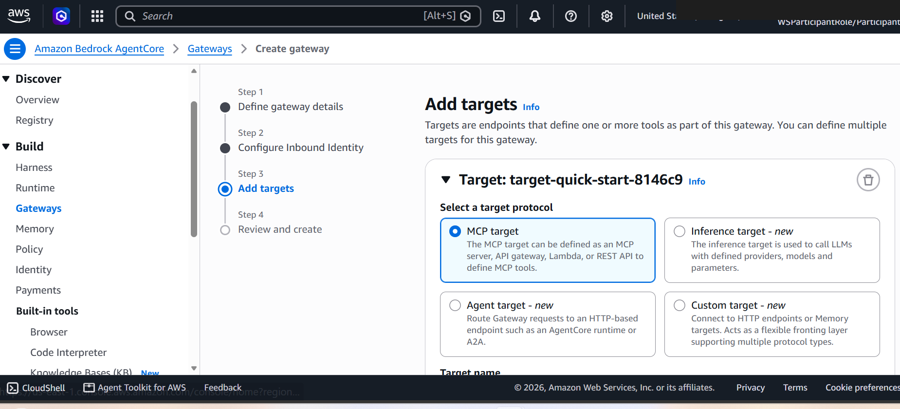
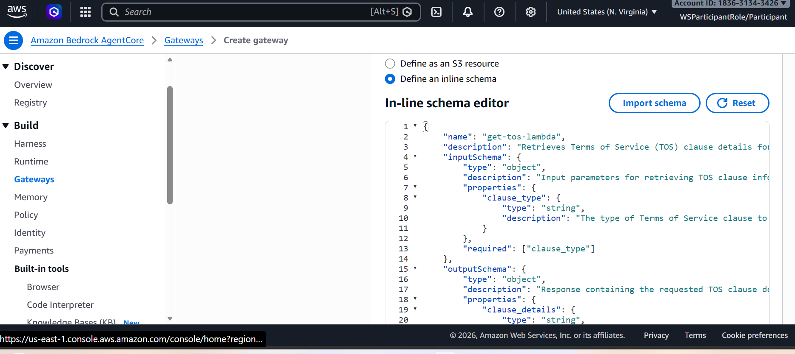

The final review step shows the gateway's IAM role permissions before creation:

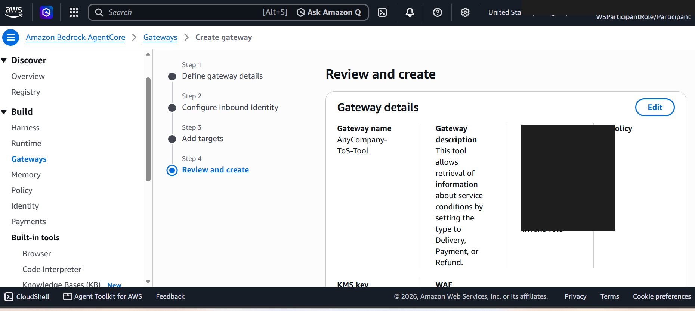
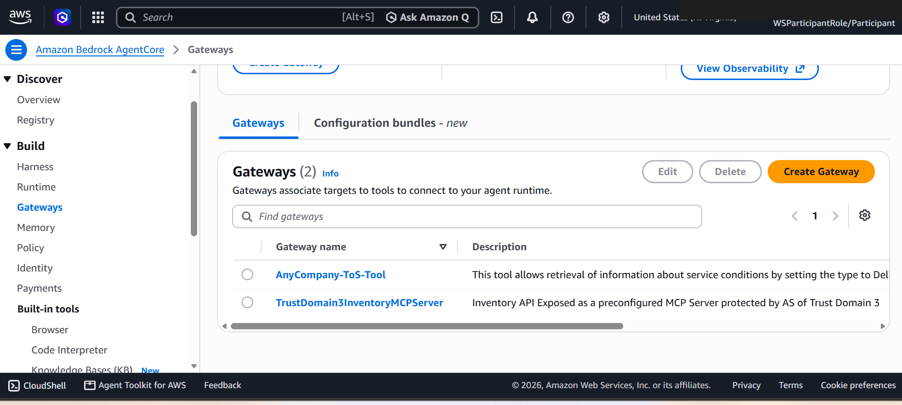

## Wiring the gateway into the agent

`activity2_gen.sh` is the first of the five generator scripts - it takes the gateway's MCP URL as
its one argument, normalizes it to end in `/mcp`, and splices a connection snippet between the
`START OF ACTIVITY 2` / `END OF ACTIVITY 2` markers in `agent_core.py`:

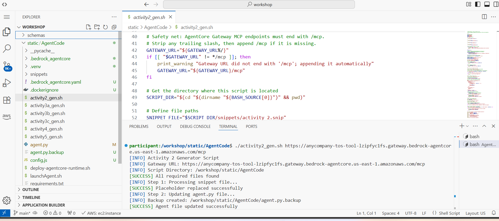

The snippet it inserts registers a tool group using
`create_streamable_http_transport_sigv4` - the SigV4-signing transport in
[`code/streamable_http_sigv4.py`](../code/streamable_http_sigv4.py) - since this gateway's inbound
auth is IAM, not Cognito. Redeploying picks the change up the same way as Activity 1:

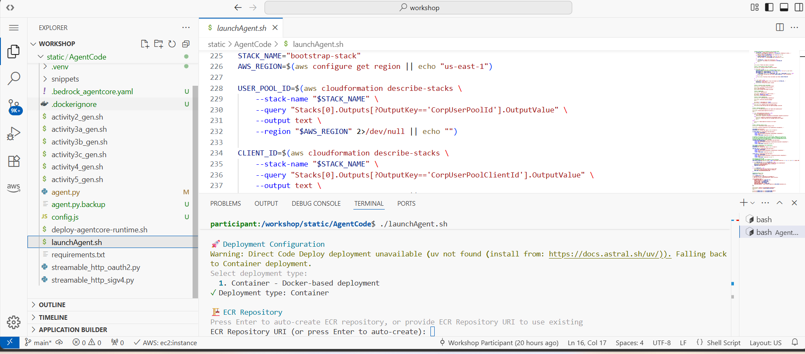
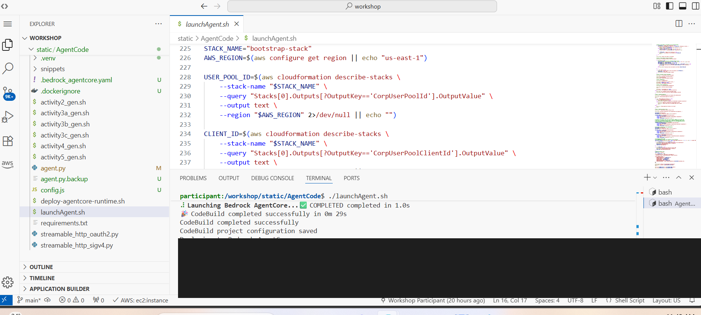
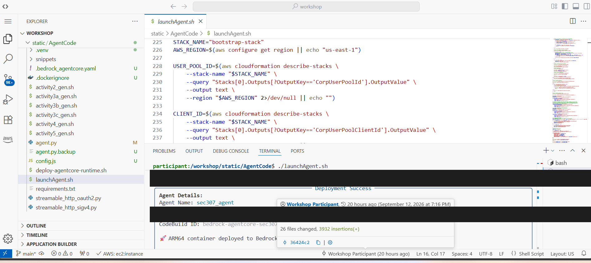

## Testing the first grounded answer

With the Terms of Service tool live, the same "decline everything" agent from Module 1 can now
answer a real policy question, sourced entirely from the tool's response:

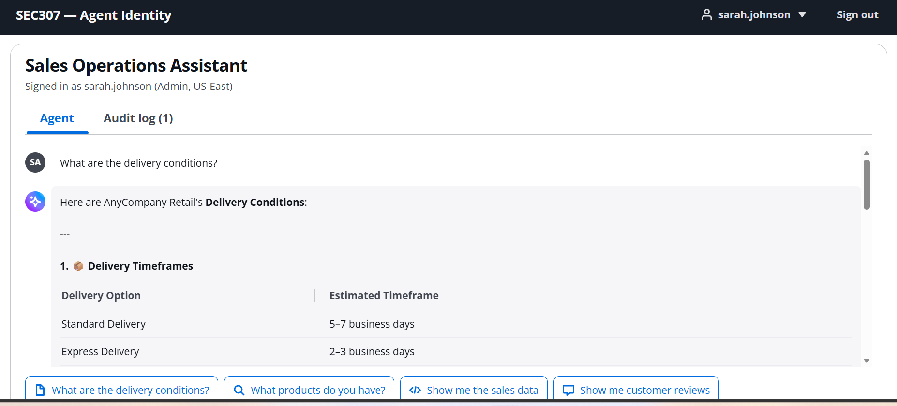
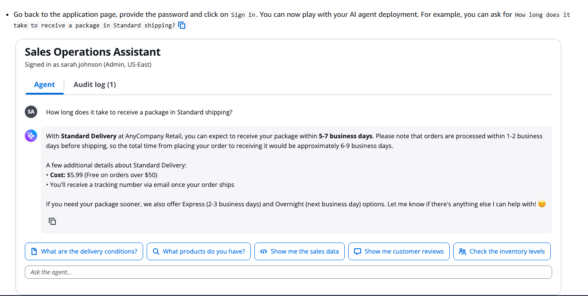

## What this activity establishes

The `TOOL_GROUPS` registry pattern in `agent_core.py` (see
[`code/README.md`](../code/README.md)) is introduced here in its simplest form: one group, one
connection function, no resource ids yet (AVP filtering doesn't exist until
[Activity 5](05-activity5-dynamic-tool-filtering-capability.md)). Every later activity adds a group to the same
list rather than restructuring how tools are loaded - see
[Activity 3](03-activity3-sales-products-reviews-tools.md) for the first gateway that fronts more than one tool
at once.
