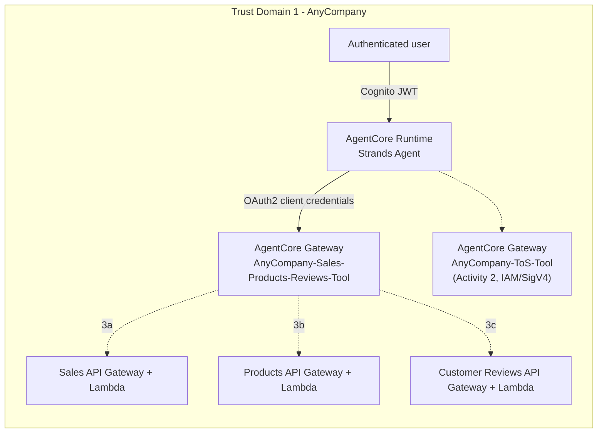

# Activity 3: Deploy the Sales, Products, and Reviews tools

## A second gateway, a different inbound auth mode

Activity 3 introduces a second AgentCore Gateway, this time with **Cognito OAuth2** inbound auth
instead of Activity 2's IAM/SigV4. Three sub-activities each add one more target and one more
OAuth2 client to the *same* gateway, rather than standing up a new one each time:

- [Activity 3a - Deploy the Sales tool](03a-activity3a-deploy-the-sales-tool.md)
- [Activity 3b - Deploy the Products tool](03b-activity3b-deploy-the-products-tool.md)
- [Activity 3c - Deploy the Customer Reviews tool](03c-activity3c-deploy-the-customer-reviews-tool.md)

This is the end state after all three sub-activities finish - the diagram in each sub-activity's
own doc shows only the targets added *so far*, to make the incremental build visible one step at a
time.

## Why one gateway, three targets

Keeping Sales/Products/Reviews on a single gateway (versus a gateway per tool, as Activity 2 used)
demonstrates the other half of the HLD's "incremental adoption" requirement (NF4): a gateway is a
trust boundary, not a per-tool object. Each target still gets its own OAuth2 client for outbound
credential separation, but they all answer to the same inbound JWT authorizer - adding a fourth
tool here would mean one more target and one more app client, not a new gateway.

Activity 4 deliberately breaks this pattern by using a *separate* gateway, because it crosses an
actual trust domain - see [Activity 4](04-activity4-add-the-inventory-mcp-tool.md).
