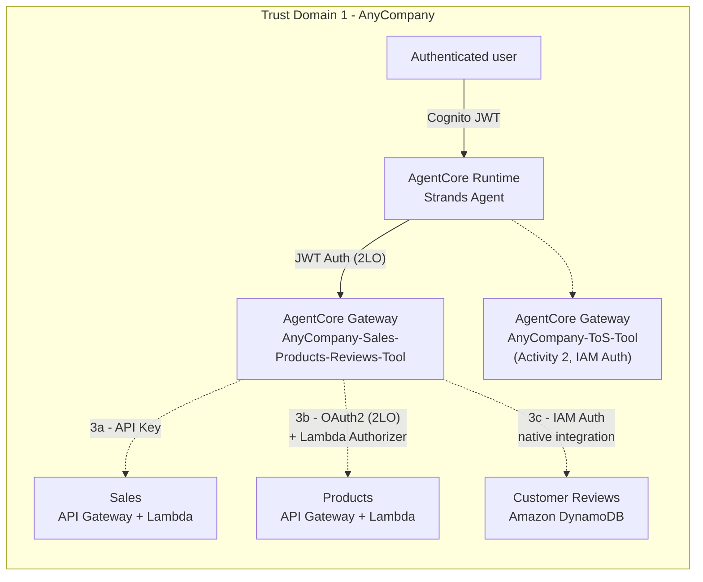

# Activity 3: Deploy the Sales, Products, and Reviews tools

## One gateway, three targets, three different backend auth modes

Activity 3 introduces a second AgentCore Gateway, with **Cognito JWT (2LO)** inbound auth from the
Runtime - unlike Activity 2's IAM/SigV4. Three sub-activities each add one more *target* to the
*same* gateway, but - unlike what a uniform "OAuth2 everywhere" assumption would suggest - each
target authenticates to its own backend differently, based on what that backend natively supports:

| Sub-activity | Backend | Target-side auth |
|---|---|---|
| [3a - Sales](03a-activity3a-deploy-the-sales-tool.md) | Amazon API Gateway + Lambda | **API Key** |
| [3b - Products](03b-activity3b-deploy-the-products-tool.md) | Amazon API Gateway + Lambda, behind a Lambda Authorizer | **OAuth 2.0 token (2LO)** |
| [3c - Customer Reviews](03c-activity3c-deploy-the-customer-reviews-tool.md) | **Amazon DynamoDB**, via an AgentCore Gateway native integration (no Lambda, no API Gateway) | **AWS IAM role** |

This is the end state after all three sub-activities finish - the diagram in each sub-activity's
own doc shows only the targets added *so far*, to make the incremental build visible one step at a
time. (This corrected diagram, and the auth-mode table above, are drawn from the workshop's own
"Choose your own adventure" reference table and Architecture Focus diagrams, cross-checked against
the console screenshots in each sub-activity's doc - an earlier draft of this page had assumed all
three targets used the same OAuth2 pattern, which the workshop's own diagrams show isn't the case.)

## Why one gateway, heterogeneous targets

Keeping Sales/Products/Reviews on a single gateway (versus a gateway per tool, as Activity 2 used)
demonstrates the other half of the HLD's "incremental adoption" requirement (NF4): a gateway is an
*inbound* trust boundary, not a per-tool object - the gateway decides once whether the Runtime may
call in at all (JWT 2LO), completely independent of how each individual target then authenticates
*outbound* to its own backend. That independence is what makes it unsurprising - not a
contradiction - that Sales uses a bare API key while Products needs a full OAuth2 client and Reviews
needs neither, just an IAM role: the gateway's inbound contract with the Runtime never changes when
a target's outbound auth does. Adding a fourth tool here would still mean one more target on this
same gateway, not a new one - whatever auth that backend happens to need.

Activity 4 deliberately *does* introduce a new gateway, because it crosses an actual trust
domain - see [Activity 4](04-activity4-add-the-inventory-mcp-tool.md).
