# Activity 3a: Deploy the Sales tool

Part of [Activity 3: Deploy the Sales, Products, and Reviews tools](03-activity3-sales-products-reviews-tools.md).

## Architecture after this activity

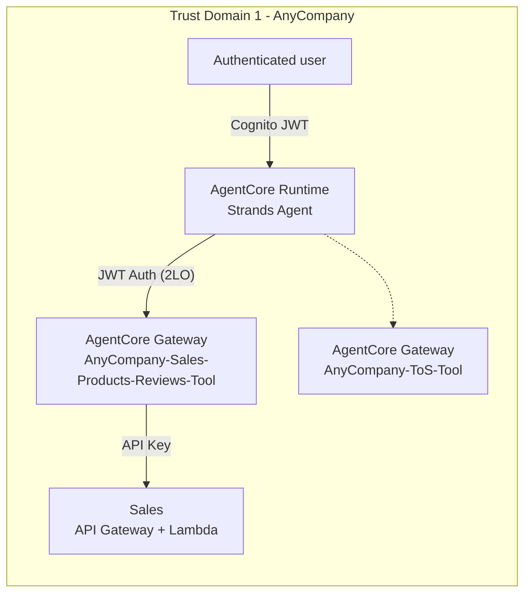

Note the two auth modes in play here aren't the same thing: the Runtime authenticates *to the
gateway* with a JWT (2LO) - that's Activity 3's whole gateway, uniform across every target added
in this and the next two sub-activities. The gateway then authenticates *to the Sales backend* with
a bare **API key** - a target-level auth choice independent of the gateway's own inbound mode. See
[Activity 3's overview](03-activity3-sales-products-reviews-tools.md#one-gateway-three-targets-three-different-backend-auth-modes)
for why Products and Customer Reviews use two more, different target-level auth modes on this same
gateway.

Only the Sales target is live so far - Products and Reviews are added in
[3b](03b-activity3b-deploy-the-products-tool.md) and [3c](03c-activity3c-deploy-the-customer-reviews-tool.md).

## Setting up the gateway and its outbound auth

The Sales Lambda's outputs are fetched from CloudFormation first:

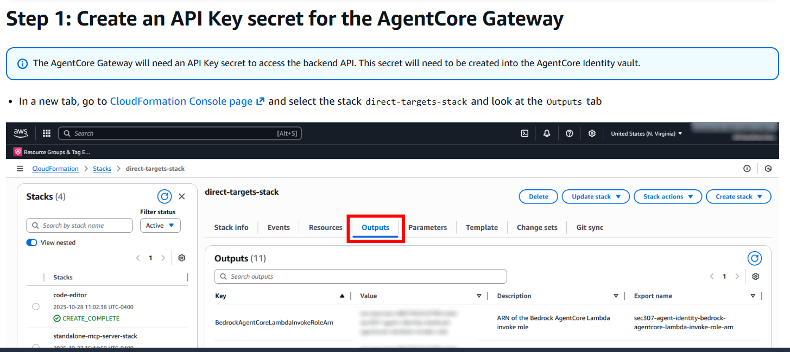

AgentCore Identity's outbound auth list already shows OAuth2 credential providers for both
Inventory and Sales MCP clients, plus the shared Cognito OAuth2 provider - set up ahead of the
gateway itself:

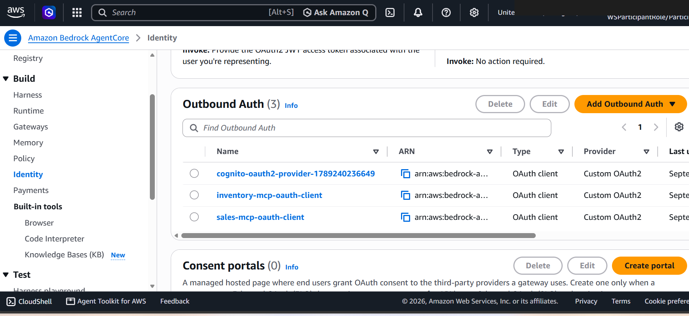

Worth flagging honestly: this console screen shows a `sales-mcp-oauth-client` OAuth2 provider
already provisioned, yet the workshop's own architecture diagrams and reference table both
consistently label the Sales target's actual auth as a plain **API key**, not OAuth2 (see
[Activity 3's overview](03-activity3-sales-products-reviews-tools.md)). The most likely
explanation is that the bootstrap stack pre-provisions credential providers for more than one
"choose your own adventure" path than any single participant actually exercises - this repo
follows the diagrams' API Key labeling below since that's what's shown wired to the deployed
target, but the unused OAuth2 provider is left visible here rather than quietly ignored.

Configuring inbound identity for the new gateway selects JWT this time, pointed at the Cognito
user pool:

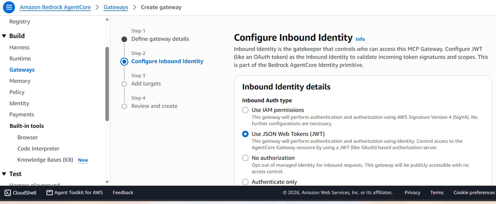

The Cognito user pool (`sec307-agent-identity-corp-pool`) backing all of this already has five app
clients defined - one per tool plus a frontend client - visible in the console:

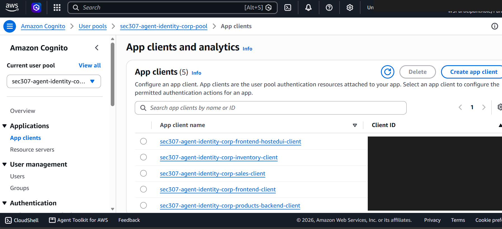
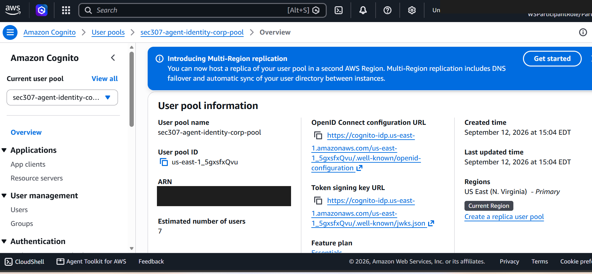

The gateway's JWT authorizer config points at that pool's discovery URL directly:

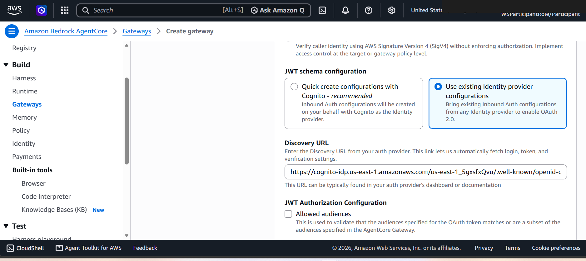

## Adding the Sales target

[`code/schemas/view-sales-api.json`](../code/schemas/view-sales-api.json) is the OpenAPI spec for
this target - an API Gateway endpoint, not a bare Lambda, which is why it needs a `servers.url`
filled in with the real execute-api endpoint before it can be used:

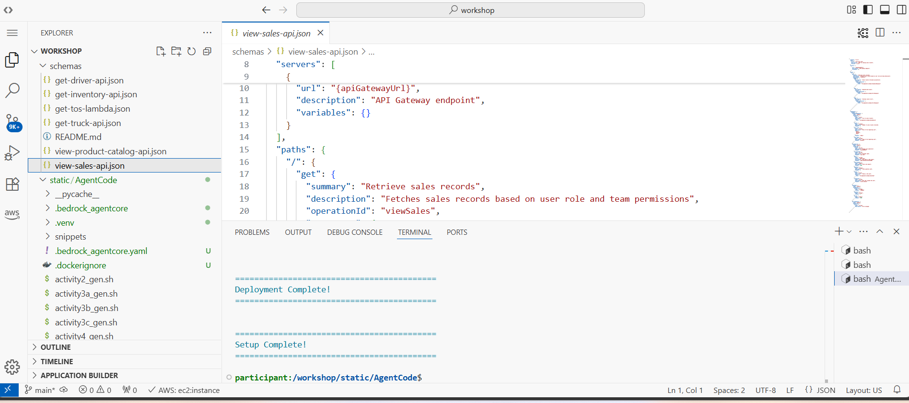
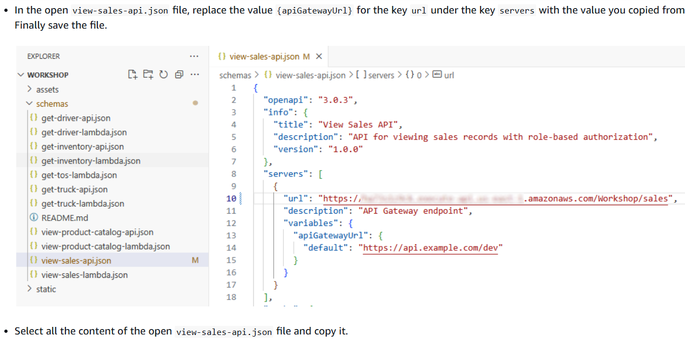
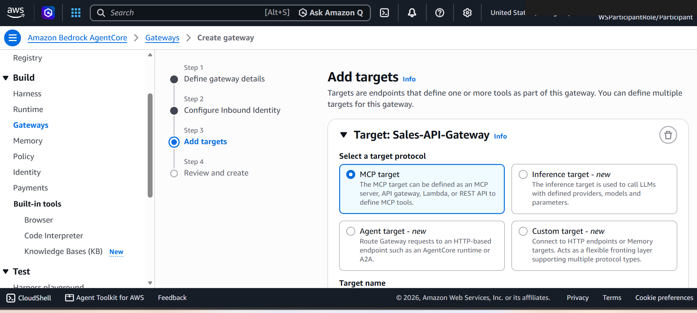
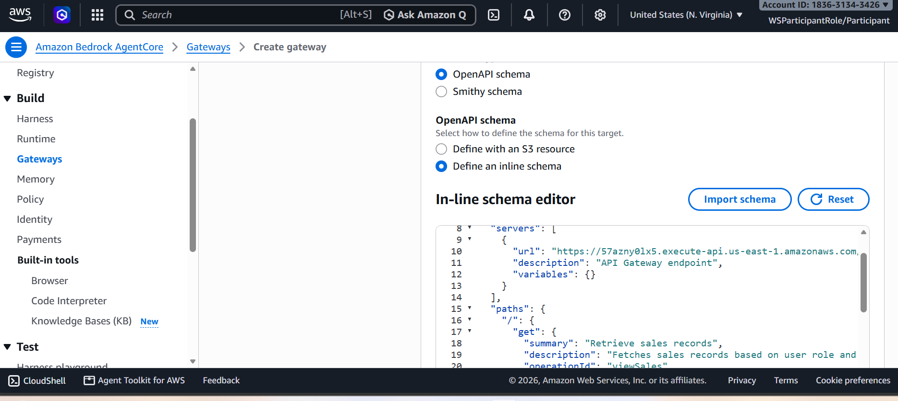
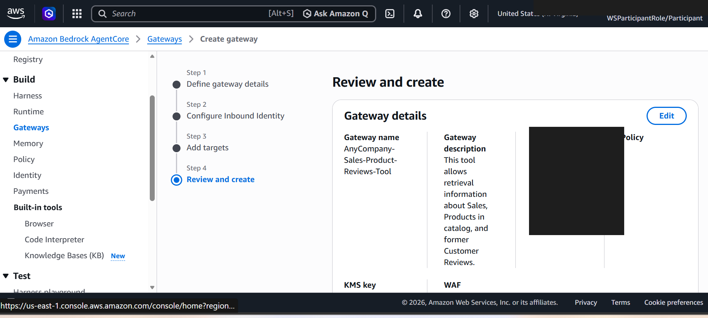

## Wiring it into the agent and testing

`activity3a_gen.sh` wires the new gateway's URL into `agent_core.py`, the same splice pattern used
in [Activity 2](02-activity2-add-the-terms-of-service-tool.md):

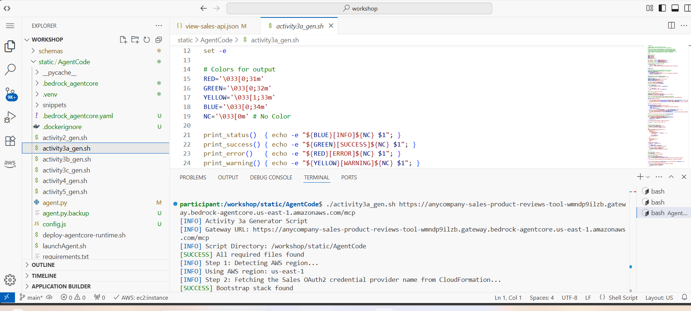

Testing confirms the agent can now answer sales questions grounded in the live API:

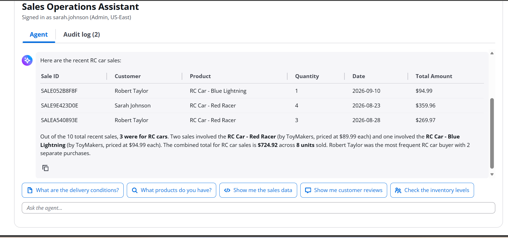
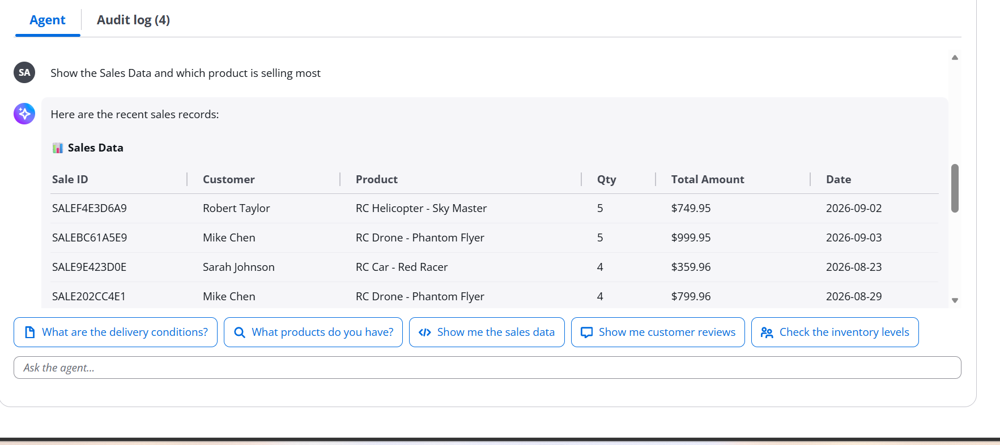

Next: [Activity 3b - Deploy the Products tool](03b-activity3b-deploy-the-products-tool.md).
