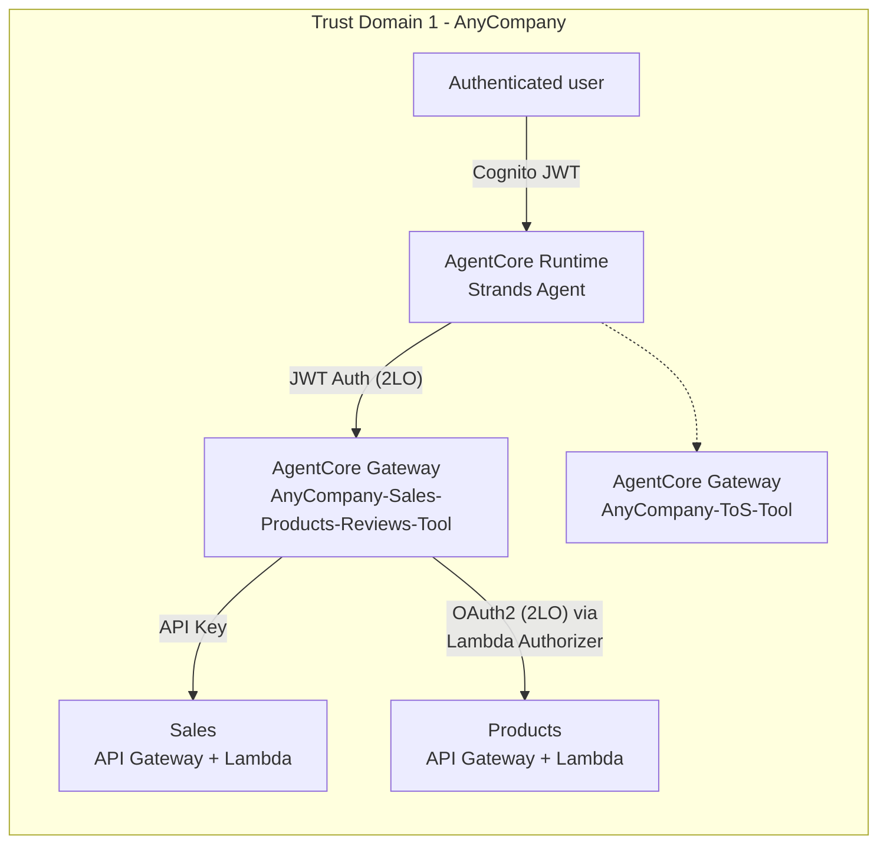
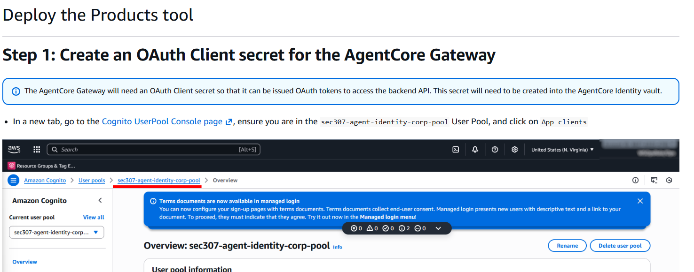
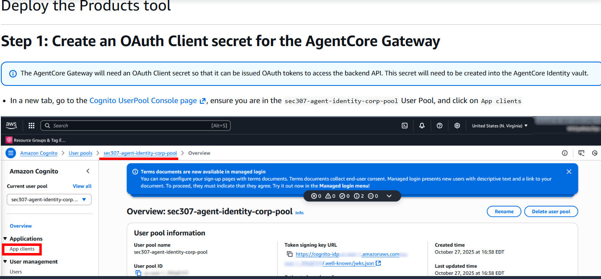
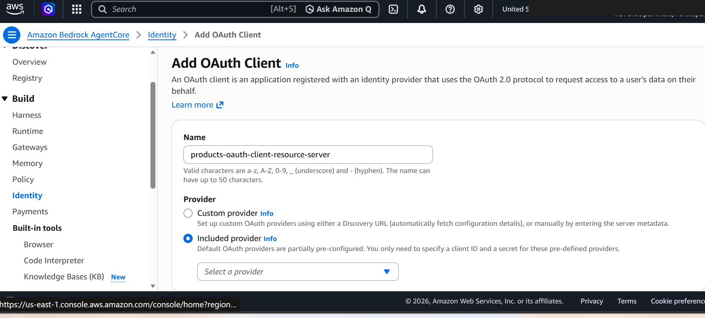
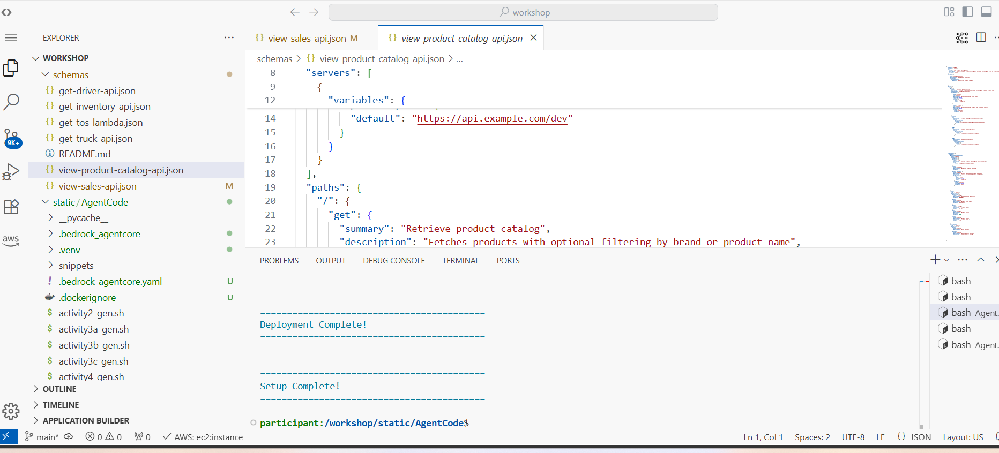
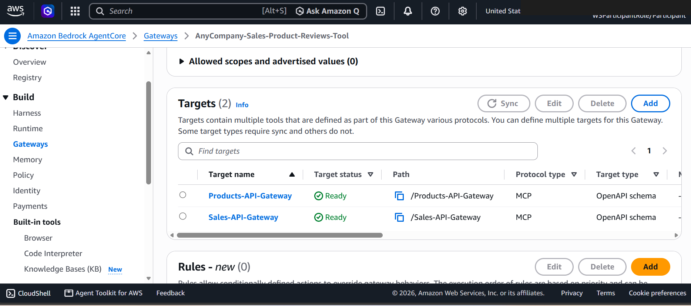
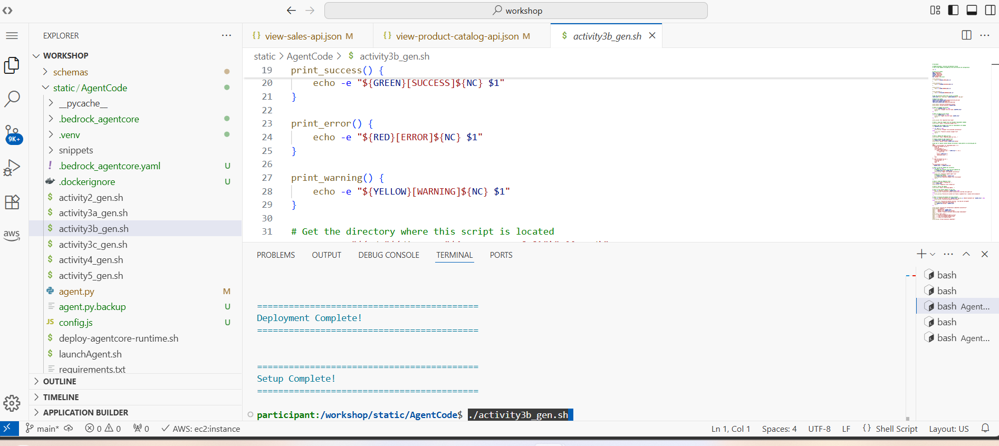
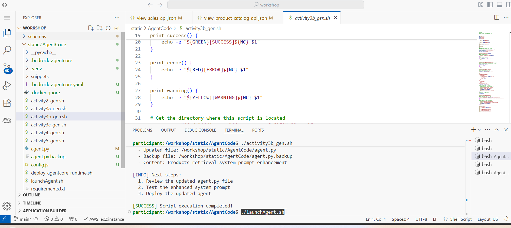
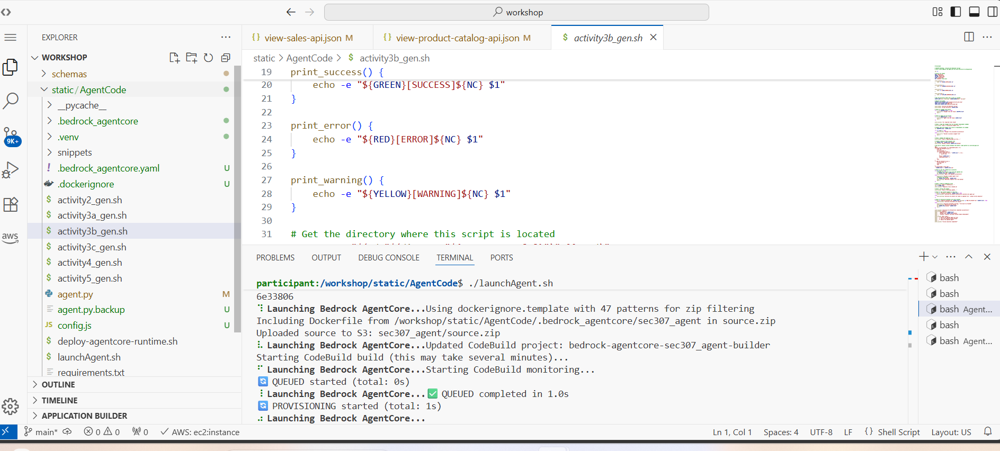
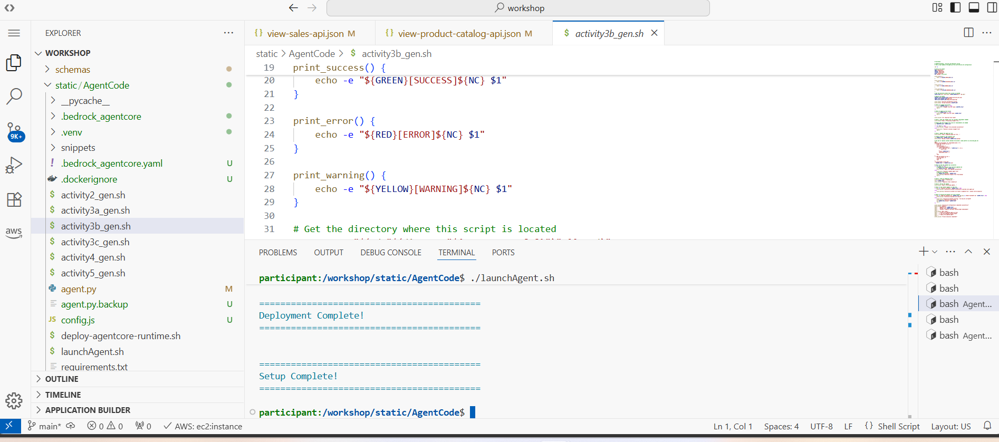

# Activity 3b: Deploy the Products tool

Part of [Activity 3: Deploy the Sales, Products, and Reviews tools](03-activity3-sales-products-reviews-tools.md).
Follows [Activity 3a - Sales](03a-activity3a-deploy-the-sales-tool.md).

## Architecture after this activity

Sales and Products are both live now - Reviews is added next in
[3c](03c-activity3c-deploy-the-customer-reviews-tool.md). Unlike Sales's bare API key, Products'
target auth is a genuine OAuth2 client-credentials flow, enforced by a **Lambda Authorizer** sitting
in front of the Products API Gateway - the authorizer is what actually validates the OAuth2 token
before the request reaches the Lambda, rather than API Gateway's native auth options.

## A new OAuth2 client for a new target

Each new tool in this gateway gets its own OAuth2 app client where its backend calls for one - the
instructions walk through creating a client-credentials secret specific to the Products tool:

## Adding the Products target

[`code/schemas/view-product-catalog-api.json`](../code/schemas/view-product-catalog-api.json)
supports filtering by brand and product name (see the `curl` examples in
[`code/schemas/README.md`](../code/schemas/README.md)):

## Wiring it into the agent and testing

`activity3b_gen.sh` follows the same pattern, updating both the tool connection and the system
prompt's description of what the agent can now do:

Next: [Activity 3c - Deploy the Customer Reviews tool](03c-activity3c-deploy-the-customer-reviews-tool.md).
