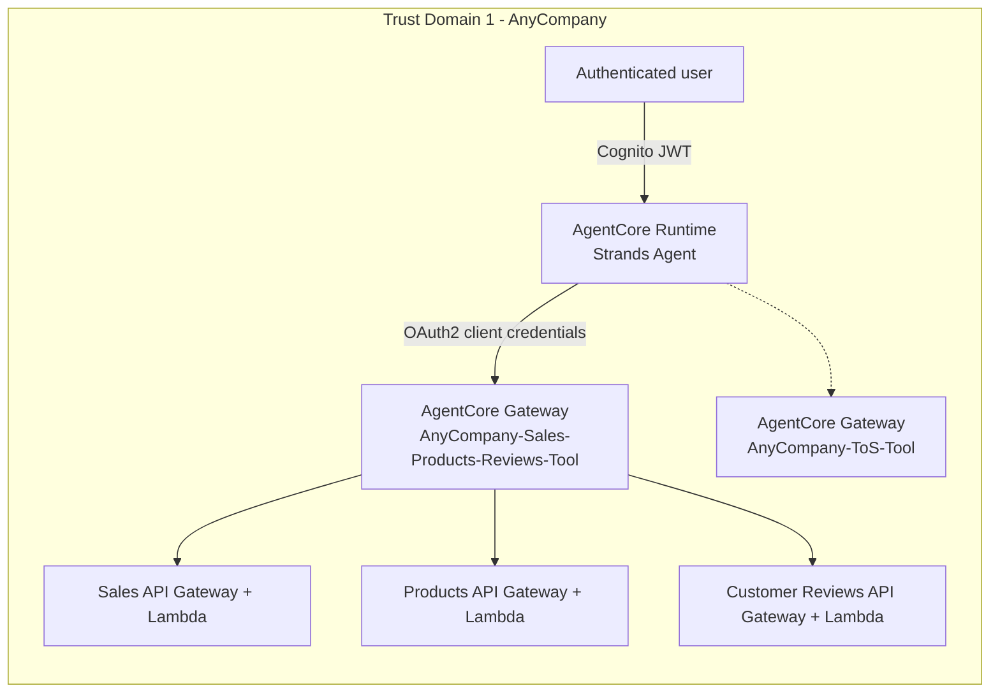
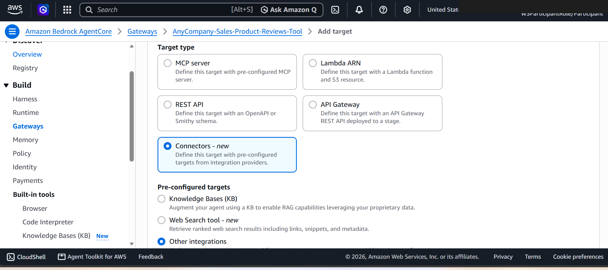
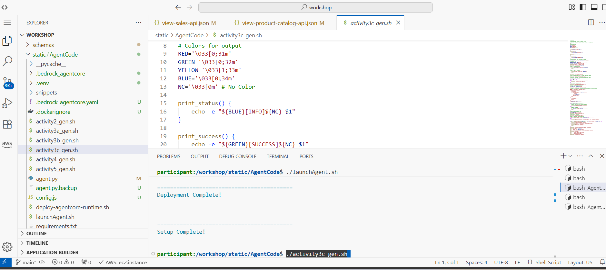
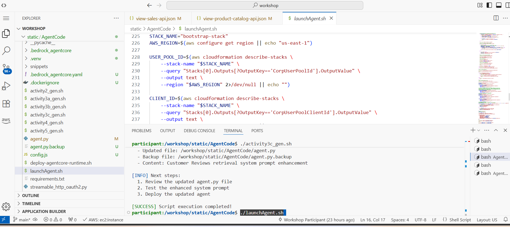
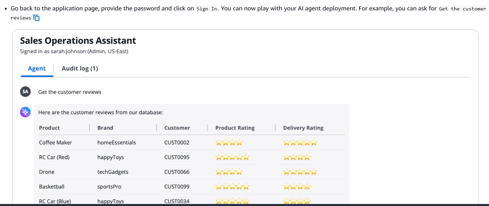
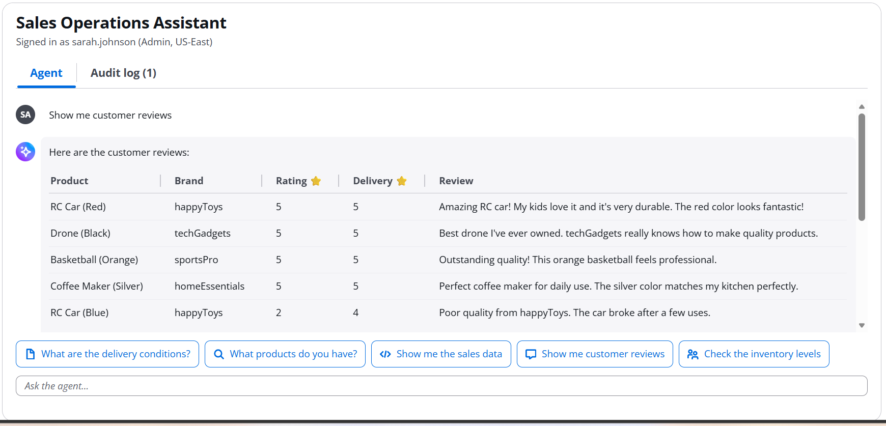
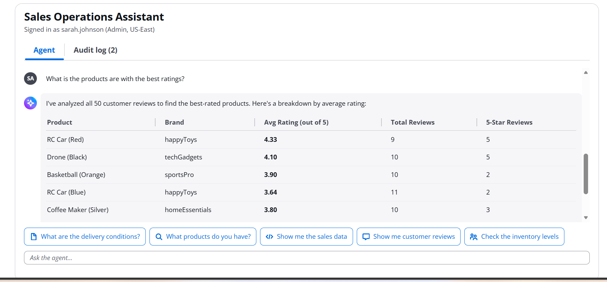

# Activity 3c: Deploy the Customer Reviews tool

Part of [Activity 3: Deploy the Sales, Products, and Reviews tools](03-activity3-sales-products-reviews-tools.md).
Follows [Activity 3b - Products](03b-activity3b-deploy-the-products-tool.md).

## Architecture after this activity

All three Activity 3 targets are now live behind the one gateway - this is the end state carried
into [Activity 4](04-activity4-add-the-inventory-mcp-tool.md).

## Adding the third target to the same gateway

## Testing the complete Activity 3 toolset

With all three Activity 3 tools live, the agent can answer sales, catalog, and review questions in
the same conversation:

Next: [Activity 4 - Add the Inventory MCP Tool](04-activity4-add-the-inventory-mcp-tool.md).
