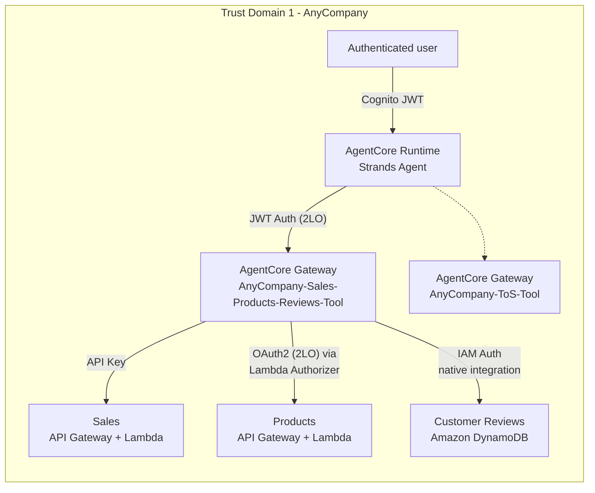

# Activity 3c: Deploy the Customer Reviews tool

Part of [Activity 3: Deploy the Sales, Products, and Reviews tools](03-activity3-sales-products-reviews-tools.md).
Follows [Activity 3b - Products](03b-activity3b-deploy-the-products-tool.md).

## Architecture after this activity

All three Activity 3 targets are now live behind the one gateway - this is the end state carried
into [Activity 4](04-activity4-add-the-inventory-mcp-tool.md).

## A different kind of target: no Lambda, no API Gateway

Sales and Products both front a Lambda through an API Gateway. Customer Reviews doesn't - it reads
directly from **Amazon DynamoDB** through an AgentCore Gateway **native integration** (Connectors
target type), authenticated with a plain **AWS IAM role** rather than an API key or OAuth2 client.
That's also why there's no `view-customer-reviews-api.json` alongside the other five schemas in
[`code/schemas/`](../code/schemas) - a native DynamoDB integration doesn't need a hand-authored
OpenAPI or Lambda schema the way a custom backend does; AgentCore Gateway generates the tool
interface from the table itself.

Adding the target means picking "Connectors" rather than the MCP server / Lambda ARN / REST API /
API Gateway options used by every other target so far:

## Wiring it into the agent and testing

`activity3c_gen.sh` follows the same splice pattern as every other activity - from the agent's
side, a DynamoDB-backed native integration tool is indistinguishable from a Lambda-backed one, since
both simply show up as MCP tools once the gateway's target is Ready:

With all three Activity 3 tools live, the agent can answer sales, catalog, and review questions in
the same conversation:

## What this target proves

Three targets on one gateway, three completely different backend technologies (Lambda-behind-API-
Gateway twice, DynamoDB directly) and three different auth modes (API key, OAuth2, IAM role) - none
of it visible to the Runtime, which only ever sees "three more MCP tools" once
`build_session_tools()` lists them. The gateway is doing real integration work here, not just
proxying a uniform backend shape.

Next: [Activity 4 - Add the Inventory MCP Tool](04-activity4-add-the-inventory-mcp-tool.md).
