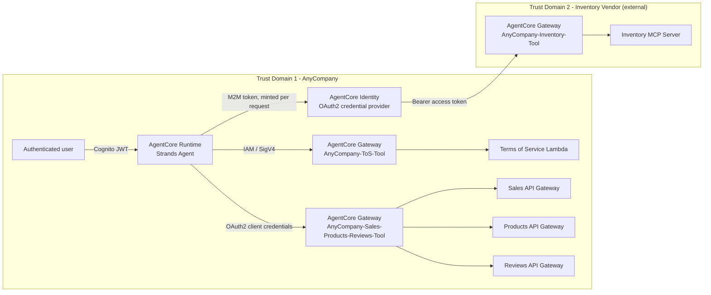

# Activity 4: Add the Inventory MCP Tool

## Architecture after this activity

The first box outside AnyCompany's own trust domain. AgentCore Identity is what makes the dashed
line into Trust Domain 2 possible without a standing, shared secret - see
[`architecture/gateway-identity-flow.md`](../architecture/gateway-identity-flow.md) for the full
per-request token exchange.

## A tool AnyCompany doesn't own

Every tool so far lives inside AnyCompany's own AWS account. Activity 4 adds a tool that doesn't:
an Inventory MCP server run by an external supplier, in a trust domain AnyCompany has no account
in. This is the activity that actually needs [`code/agent_core.py`](../code/agent_core.py)'s third
transport function, `create_streamable_http_transport_agentcore_identity` - the other two
(SigV4, OAuth2-with-embedded-secret) can't cross an account boundary without a shared, standing
credential.

## Setting up the outbound OAuth2 client

An OAuth2 client for the Inventory vendor's MCP server is created in Cognito, but its secret is
handed to **AgentCore Identity**, not the agent:

`activity4_gen.sh` (see [`code/README.md`](../code/README.md)) is explicit in its own comments
about why: *"this script NO LONGER fetches or embeds the Cognito client secret... the agent
exchanges its workload identity for a token at runtime (M2M)."* Only the non-secret provider name
and gateway URL get injected into `agent_core.py` - the secret itself never leaves AgentCore
Identity's vault.

## A new gateway for a new trust boundary

Unlike Activity 3's targets, which shared one gateway, Inventory gets its own:

## The M2M token exchange at runtime

`agent_core.py`'s `create_streamable_http_transport_agentcore_identity` wraps a function decorated
with `@requires_access_token(..., auth_flow="M2M")` from `bedrock_agentcore.identity.auth` - at
connection time, the agent exchanges its own workload identity for a short-lived access token
scoped to the Inventory provider, then attaches it as a Bearer token on the MCP connection. Because
this callback runs inside Strands' async background thread, `agent_core.py` also has to route it
through `_run_coroutine_blocking` to avoid an `asyncio.run() cannot be called from a running event
loop` error - a detail visible only in the source, not in any console screen, but worth calling out
since it's the kind of runtime-context bug that only surfaces under Strands' specific threading
model.

## Testing across the trust boundary

With the token exchange wired in, the agent can query the external vendor's inventory as if it
were a local tool - the trust boundary is invisible from the chat interface:

The second test is the more interesting one: "most selling products" pulls from *both* the Sales
tool (Activity 3a, same-account) and the Inventory tool (this activity, cross-account) in a single
response, with the agent never needing to know or care that the two tools authenticate completely
differently under the hood.

## What this activity proves

F2 and F4 from the [HLD](../architecture/HLD.md#requirements) - crossing a trust boundary, and
never storing a client secret in the agent's own code or image - are satisfied by the same
mechanism: AgentCore Identity as a credential vault the agent's workload identity can exchange
against, per request, rather than a secret baked into a config file. See
[`architecture/gateway-identity-flow.md`](../architecture/gateway-identity-flow.md) for the full
request sequence through this exact path. The next question - whether *every* authenticated user
should be able to reach this tool at all - isn't answered until
[Activity 5](05-activity5-dynamic-tool-filtering-capability.md).
