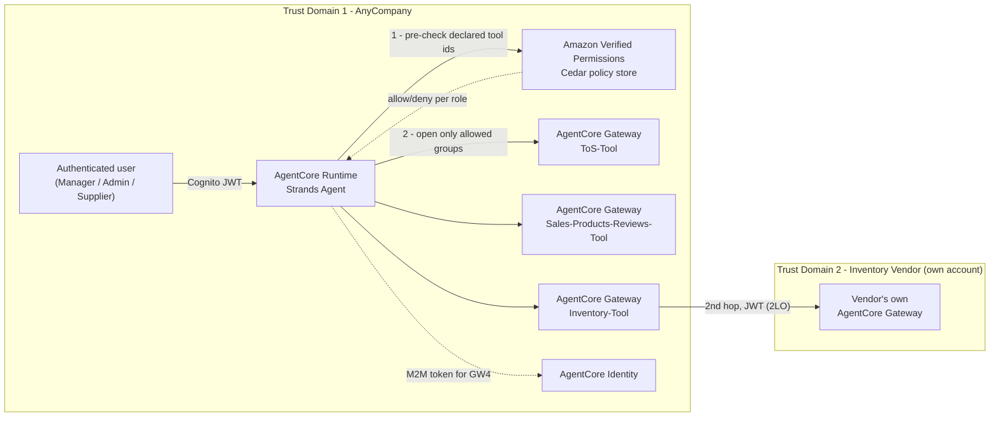
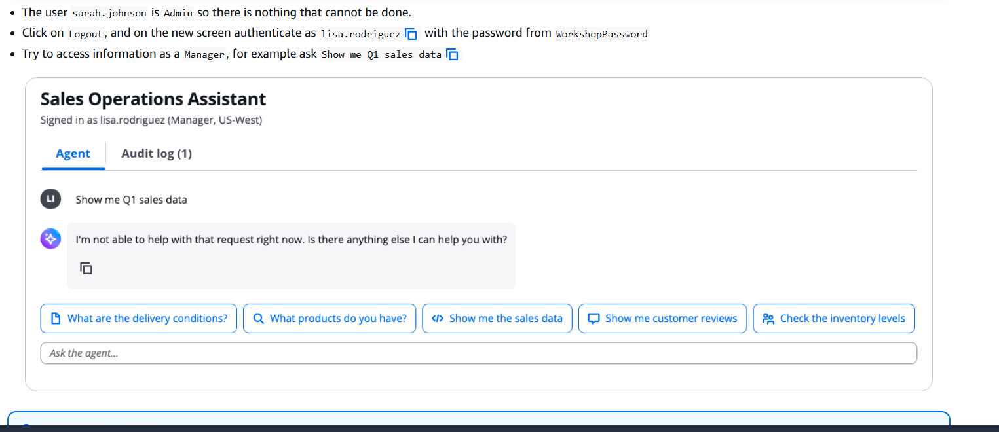
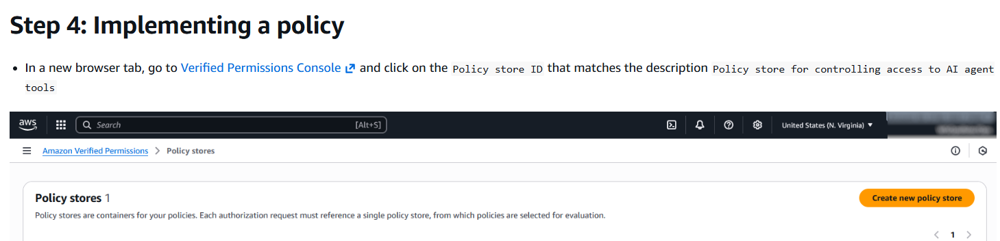
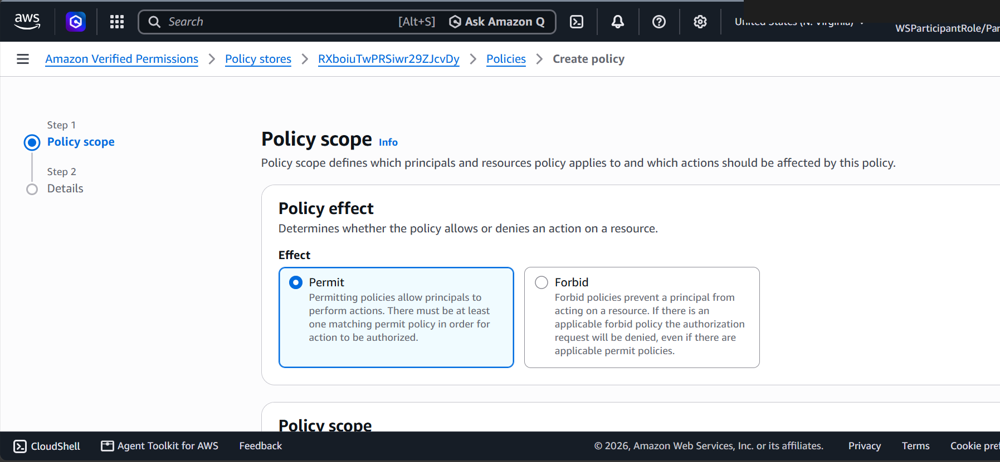
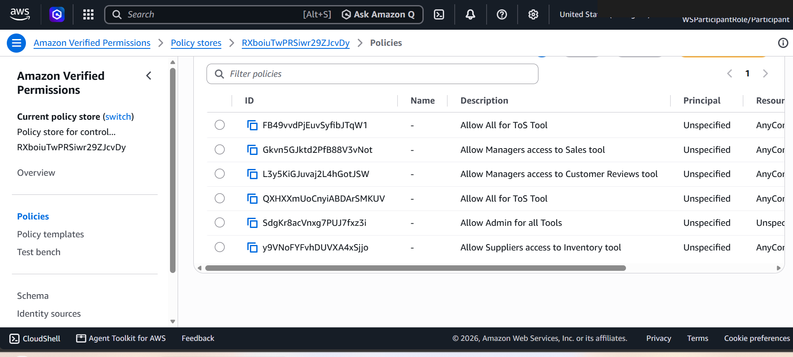
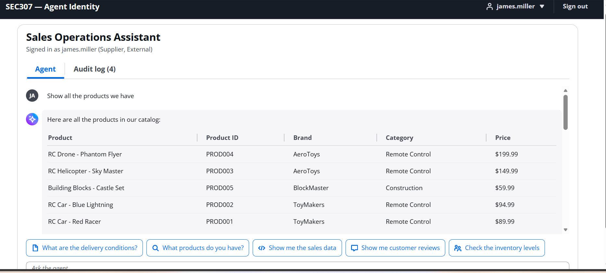
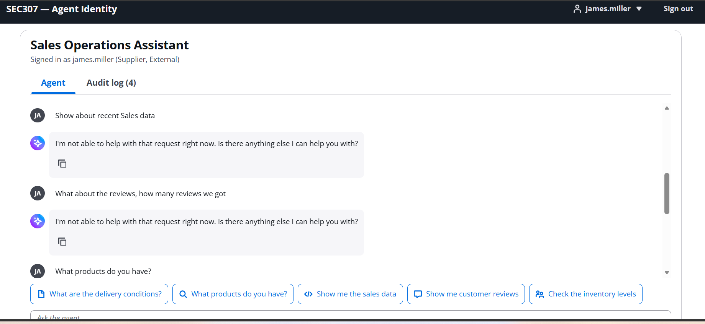
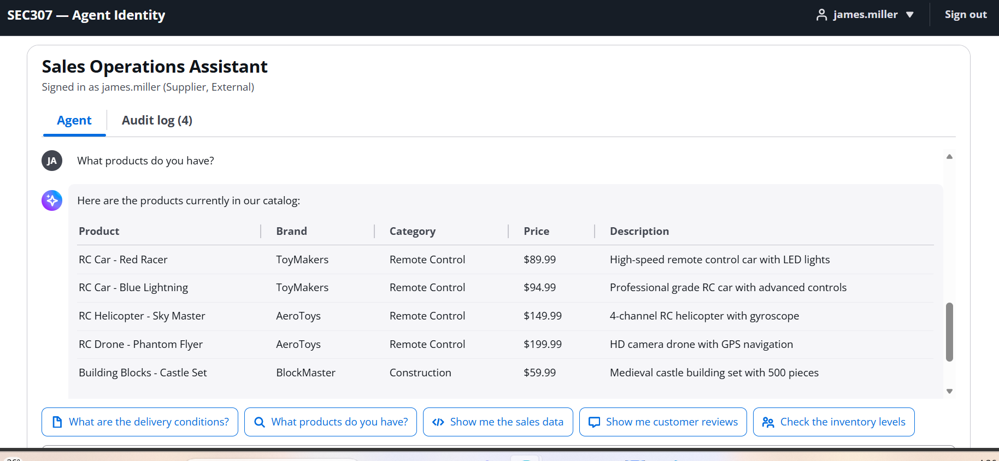
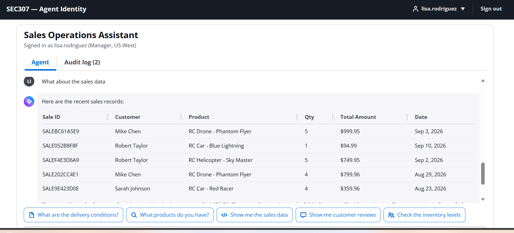
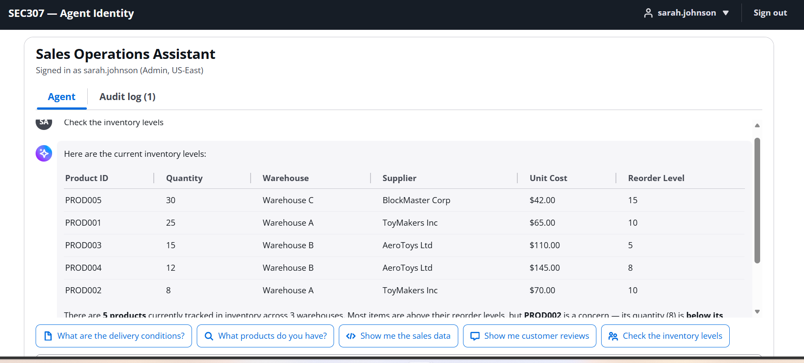

# Activity 5: Add the dynamic tool filtering capability

## Architecture after this activity

The same gateways and the same cross-trust-domain chain from
[Activity 4](04-activity4-add-the-inventory-mcp-tool.md) - what's new is the Verified Permissions
gate in front of all of them, which decides *per authenticated caller* which of those boxes are
even reachable this request. A Supplier denied the Inventory tool group never gets as far as
`AnyCompany-Inventory-Tool`, let alone the vendor's own gateway behind it. See
[`architecture/gateway-identity-flow.md`](../architecture/gateway-identity-flow.md) for the full
two-phase check.

## The last question: who gets to see which tools

Activities 2-4 answered "can the agent authenticate to this tool at all." Activity 5 answers a
different question: of the tools the agent *can* reach, which ones should *this specific,
authenticated caller* be allowed to use? Three roles are tested against the same running
agent - a Manager (`lisa.rodriguez`), an external Supplier (`james.miller`), and an Admin
(`sarah.johnson`) - each seeing a different toolset without a single line of per-role branching in
`agent_core.py`.

Before any policy exists, a Manager asking for data outside their role gets denied - the baseline
this activity is built to fix with an explicit, auditable rule instead of an implicit gap:

## Amazon Verified Permissions and Cedar

A **policy store** is the container for every Cedar policy evaluated on this project's tool-access
decisions:

Each policy is a `Permit` or `Forbid` statement over three things: a **principal** (the
authenticated caller, identified by their Cognito claims), an **action** (`AccessTool`, the only
action this project's Cedar schema defines), and a **resource** (a specific tool, identified by its
gateway target name prefix - e.g. `get-inventory`, `view-sales`). Creating one is a guided
console flow:

By the end of the activity, six policies exist covering Terms of Service, Sales, Customer Reviews,
Admin, Inventory, and one more role/tool pairing - each a separate, independently auditable rule
rather than a branch in application code:

## How the agent actually enforces this

The policy store's ID gets wired into `agent_core.py` via `set_avp_policy_store(...)`, which is
what flips `AVP_POLICY_STORE_ID` from `None` to an active gate in `build_session_tools()`. From
that point on, every request runs the two-phase check described in the
[HLD](../architecture/HLD.md#how-authorization-actually-happens-on-each-request):

1. **Pre-check** - `_authorize_tool_ids` is called once with every tool group's *declared*
   resource ids. A group with none allowed never gets its MCP connection opened at all - no wasted
   round-trip, no outbound token minted for a caller who can't use anything behind it.
2. **Authoritative check** - once a group's real tool list comes back from its gateway, the actual
   tool-name prefixes (the part before `___` in a gateway-qualified tool name) are checked again.
   This is what's actually binding - the declared ids are only an optimization, not the source of
   truth - which matters for a gateway that ends up fronting more targets than were declared ahead
   of time.

Both checks call `verifiedpermissions.batch_is_authorized_with_token`, passing the *caller's own*
bearer token (extracted from the inbound request's `Authorization` header) as the principal - the
agent's own service identity is never what's being authorized here, only the human on the other end
of the conversation.

## Three roles, three toolsets, one agent

**Supplier** (`james.miller`, external): sees the product catalog, nothing else -

**Manager** (`lisa.rodriguez`): sales data now allowed, once the policy exists -

**Admin** (`sarah.johnson`): the broadest role, including inventory -

None of this required a different deployment, a different agent, or a role check written into the
system prompt - the exact same running container serves all three users, and the tool objects
handed to the LLM are simply different by the time `Agent(...)` is constructed for each request.

## Closing the loop on the HLD requirements

This activity is the one that satisfies F3 (per-role tool visibility) and NF1/NF3 (least privilege,
auditability) from the [High-Level Design](../architecture/HLD.md) - and it does so as a genuinely
additive layer: turn `AVP_POLICY_STORE_ID` back to `None` and every tool group loads for every
caller again, exactly as it did at the end of [Activity 4](04-activity4-add-the-inventory-mcp-tool.md). That
reversibility is itself evidence the earlier activities' identity boundaries (Gateway inbound auth,
Identity outbound credentials) were built independently of this authorization layer, not coupled to
it.
